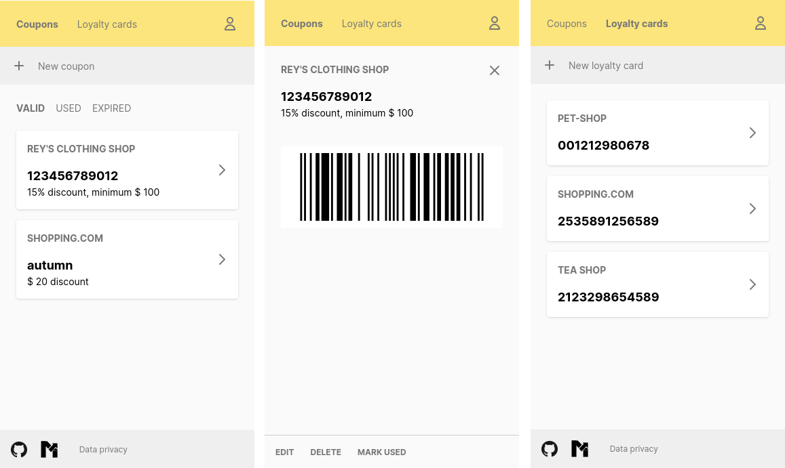

# Coupon store

A home for all your coupons and loyalty cards. Free to use at https://coupon.metikular.ch. Self-hostable and open-source (see below).



## ⭐ Features

- Store coupons and discounts
- Store loyalty cards
- Several types of barcodes and QR codes supported for coupons and loyalty cards
- Be notified via [apprise](https://github.com/caronc/apprise) when a coupon expires soon
- Dark mode

## Setup

Using a PostgreSQL database:

```shell
docker-compose -f docker-compose.example.yml up
```

Using a SQLite database:

```shell
docker-compose -f docker-compose.sqlite.yml up
```

The default port of the running webserver is `80`.

### Instance specific configuration

Add a page for data privacy by creating a file at `app/views/pages/data_privacy.html.haml`.

### Backups

All data is stored in the database. It is thus sufficient to backup the database.

If PostgreSQL is used: use `pg_dump` to backup the database specified in `DATABASE_URL`.

If SQLite is used: backup the `.sqlite3` file specified in `DATABASE_URL`. If a relative path is used to specify the database file, it is relative to the directory `/app`.

## Development

```shell
bin/setup
bin/dev
```

## Environment variables

- `DEVISE_SENDER_EMAIL`: the email address you are sending emails from
- `DATABASE_URL`: allows to set the database. PostgreSQL or SQLite3 are supported.

    Example for SQLite3:

    ```
    DATABASE_URL=sqlite3:db/development.sqlite3
    ```

## Similar projects

- [Catima](https://catima.app), Android App
- [VoucherVault](https://github.com/l4rm4nd/VoucherVault), web application using Python/Django

## License

GNU Affero General Public License v3.0
